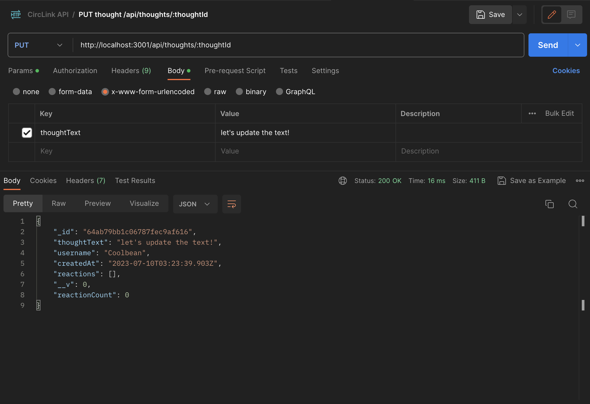

# CircLink

## Description

"CircLink" is a powerful social network API application designed to facilitate seamless connections and interactions within specific interest circles or communities. Built using MongoDB, CircLink offers a reliable and efficient API solution for developing a feature-rich social networking web application.  
With CircLink, users can easily share their thoughts, react to updates from friends, and build meaningful connections within their circles. The advantage of MongoDB's speed and flexibility in handling large amounts of data ensures optimal performance and enables smooth scalability.  
Empower your social networking application with CircLink, leveraging its intuitive API endpoints and robust functionality. Deliver a compelling user experience and unlock the potential of connected communities with CircLink. 

## Table of Contents

- [Installation](#installation)
- [Usage](#usage)
- [Contributing](#contributing)
- [Tests](#tests)
- [License](#license)
- [Questions](#questions)

## Installation

1. Clone or download the repository to your device.
2. Install node.js v18.15.0
3. Install the necessary package by typing `npm i` in the command line
4. Setup environment veriables by create a .env file and provide following: MONGODB="". Replace the empty quotes ("") with the appropriate values for your MongoDB database configuration.
5. Using API development platform such as Postman, Insomnia, etc... or curl to interact with the application's API endpoints.

## Usage

1. Optional: running `npm run seed` to seed the data.
2. Starting the by entering `npm start` or `node server.js` at the root folder.
3. Using your preferred API platform such as Postman, Insomnia, etc, perform CRUD operations on the following endpoints: users, friends, thoughts, and reactions.
4. Ensure to provide the correct wildcard keys (or route parameters) when making requests.

Please find attached demo video showcasing the installation and functionality of our application. 
https://drive.google.com/file/d/1OjEUl0tVQ30RhTnSRv51bwHDEAKs98lS/view  

## License

This project is licensed under the MIT License - see the link for detail
https://opensource.org/license/mit/

## Credits

OpenAI 
MongoDB at https://www.mongodb.com 
License Badge created by shields.io 
License links provide by opensource.org 
seed and data by UCB coding bootcamp week_18: 21  

## Tests

Currently, there is no test available.

- My GitHub: jenryt
- My email: bicodeture@gmail.com
